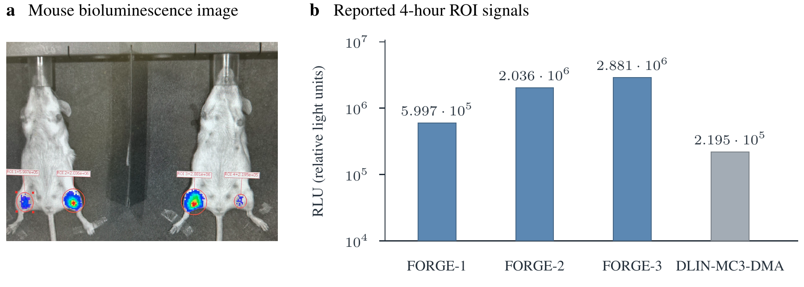

# FORGE

[Experiments](examples/README.md)

Reaction-guided generative design of ionizable lipids, using Ugi 3CR,
repeated aza-Michael addition, and repeated reductive amination.




## Installation

Use Python 3.11 and [uv](https://docs.astral.sh/uv/):

```bash
git lfs install
git lfs pull
uv sync --frozen --extra dev
source .venv/bin/activate
```

## Pretrained model weights

The full primary paper-model checkpoint archives for all three replicates and
their matching training cache are available through Git LFS. The models cover
Ugi 3CR, repeated aza-Michael addition and repeated reductive amination.

| Asset | Location | Size |
|---|---|---|
| Replicate 0 checkpoints | [seed0/checkpoints.tar](model_assets/paper-model-v1/seed0/checkpoints.tar) | 112.6 MB |
| Replicate 1 checkpoints | [seed1/checkpoints.tar](model_assets/paper-model-v1/seed1/checkpoints.tar) | 112.6 MB |
| Replicate 2 checkpoints | [seed2/checkpoints.tar](model_assets/paper-model-v1/seed2/checkpoints.tar) | 112.6 MB |
| Matching training cache | [cache.npz](model_assets/paper-model-v1/shared-inputs/results/phase1/shared_synthesis_program_mixed_cache_v1/cache.npz) | 13.7 MB |

Each archive contains checkpoints at steps 100, 500, 1,700, 4,500 and 9,143.
Generation uses the final step-9,143 checkpoint. Replicates 0–2 correspond to
training seeds 20260825, 20260826 and 20260827.

After environment installation, download, install and verify the assets:

```bash
git lfs pull
forge artifacts install --group paper-model-v1
forge artifacts verify --group paper-model-v1
```

The [model manifest](manifests/paper-model-v1.json) records the exact file sizes
and SHA-256 hashes. Installation verifies the downloaded files before copying
them to the experiment paths. Retraining and a Modal account are not required.

## Generate molecules

```bash
forge generate --replicate 0 --family ugi --count 2 --seed 42 \
  --device cpu --output results/demo
```

Use `--replicate 1` or `--replicate 2` for the other models, and
`--family aza-michael` or `--family reductive-amination` for the other reaction
families. See the [experiment guide](examples/README.md) for evaluation and training.

## Reproduce tables

```bash
forge artifacts install --group evidence-v1
forge reproduce --target all --output results/tables
```

This command aggregates the included saved results. Additional evidence caches
and optional ablation weights remain separately supplied; see the
[data and asset instructions](data/README.md).

## Structure

```text
forge/          # Library: models, flow, chemistry, data, and evaluation
examples/       # Runnable paper experiment recipes
tests/          # Local correctness checks
configs/        # Frozen experiment settings
manifests/      # Checkpoint and data identities
model_assets/   # Pretrained checkpoint archives and matching cache (Git LFS)
data/           # Processed datasets, splits and saved experiment results
```

The primary model is [model/networks/transformer.py](forge/model/networks/transformer.py), with
[semantic losses](forge/model/objectives/transformer.py) and [PCGrad](forge/model/objectives/pcgrad.py).
