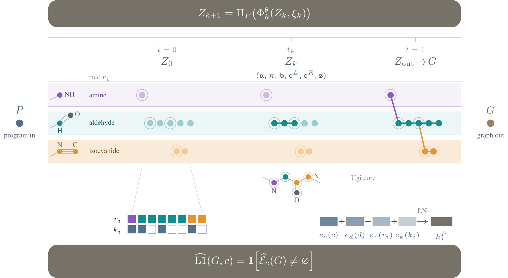

# FORGE: Reaction-Guided Generative Design of Ionizable Lipids

[Paper](paper/submission.pdf) · [LaTeX source](paper/source/main.tex)

FORGE generates whole-molecule graphs conditioned on AGILE-type Ugi 3CR, repeated aza-Michael
addition, and repeated reductive amination. This repository contains the code for submission 19337.
Exact L1 verification measures consistency with the declared reaction transform.



## Quick start

Use Python 3.11 and [uv](https://docs.astral.sh/uv/). Run from the repository root:

```bash
uv sync --frozen --extra dev --extra modal
uv run forge artifacts fetch --group paper-model-v1
uv run forge artifacts fetch --group submission19337-evidence-v1
uv run forge reproduce --target all --output results/tables
uv run forge generate --replicate 0 --family ugi --count 2 --seed 42 \
  --device cpu --output results/demo
```

`reproduce` aggregates saved results into Tables 1–11. `generate` samples the original paper weights
and saves every attempt, including failures. It also supports `aza-michael` and `reductive-amination`.
Generation uses checkpoint 9143 and 32 flow steps. Seed 42 is a demo seed, not the paper's evaluation
schedule. Use a new output directory for each command, except when resuming training.

## Checkpoints and data

Artifacts are stored in the `forge-paper-artifacts` Modal volume, workspace `kosha-labs`, environment
`main`. Teammates need GitHub access, Modal workspace membership, and their own authenticated profile
(`uv run modal token new`). Pass `--profile <name>` to artifact commands if your local profile is not
named `kosha-labs`.

| Bundle | Contents | Size |
|---|---|---:|
| `paper-model-v1` | Three primary checkpoints, training/design records, cache, registries, and summaries | 363 MB upstream bundle |
| `submission19337-evidence-v1` | Table evidence, attempt ledgers, preparation inputs, and baseline requests | 230 MB |
| `submission19337-ablations-v1` | Original architecture-study checkpoints | 4.01 GB, optional |

Fetch the optional bundle only when needed:

```bash
uv run forge artifacts fetch --group submission19337-ablations-v1
```

For offline transfer, restore downloaded bundles:

```bash
uv run forge artifacts restore --group paper-model-v1 --bundle /downloads/paper-model-v1
uv run forge artifacts restore --group submission19337-evidence-v1 \
  --bundle /downloads/submission19337-evidence-v1
```

Fetch and restore verify the committed manifest hashes and refuse to overwrite different files.

## Reproduction checks

After restoring both required bundles:

```bash
uv run python scripts/qualify_release.py --output results/release-check
uv run pytest
```

The qualification command checks all 89 numerical table rows against the manuscript and repeats two
CPU Ugi attempts using seed 42, batch size 2, and two Torch threads. It records commands, environment,
timings, input hashes, and outputs in `receipt.json`. It does not download data or train a model.
Missing bundles are rejected before execution; failed executions retain their logs and failed receipt.

## Training and evaluation

Rebuild the complete cache and run a two-step CPU smoke test:

```bash
uv run forge prepare --output results/cache-rebuild
uv run forge train --profile smoke --output results/train-smoke
uv run forge train --profile smoke --resume --output results/train-smoke
uv run forge evaluate --profile smoke --device cpu --replicate 0 \
  --config results/train-smoke/evaluation_config.json \
  --checkpoint results/train-smoke/training/checkpoints.tar \
  --training-result results/train-smoke/training/result.json \
  --study-design results/train-smoke/study_design.json \
  --output results/reassessed-training
```

Custom evaluation requires all four input arguments together. It verifies the checkpoint, design,
cache, schedule, replicate, and device. Failures inside the evaluator are retained in `<output>.failed/`.
Relative input paths resolve against the checkout root; commands accept `--root /path/to/checkout`.

Full training uses the frozen CUDA contracts:

```bash
uv run forge train --profile paper --device cuda --replicate 0 \
  --config configs/multireaction/shared_bias_parallel_shared_bias_program_role_source_v2.json \
  --output results/retrained-seed0
uv run forge train --profile paper --device cuda --replicate 1 \
  --config configs/multireaction/shared_bias_program_role_core_saturation_seeds12_v2.json \
  --output results/retrained-seed1
uv run forge evaluate --replicate 0 --device cuda --output results/evaluated-seed0
```

Repeat seed-1 training with replicate 2 and a new output directory. Training seeds are 20260825,
20260826, and 20260827; these are the independent replicates. Primary training runs use 9,143 steps
and 126 effective examples per step. Final evaluation requests 3,072 attempts per program and seed.
Use a fresh run's generated config and checkpoint companions to evaluate that run.

The same training command accepts these contracts under `configs/multireaction/`:

| Experiment | Config | Budget |
|---|---|---|
| Shared-null control | `shared_bias_shared_null_core_saturation_v1.json` | All three replicates |
| Cyclic-ID control | `shared_bias_cyclic_core_saturation_v1.json` | All three replicates |
| Global-source control | `shared_bias_parallel_shared_bias_global_source_control_v2.json` | Seed 0 |
| Architecture/FACT study | `transformer_mechanism_study_v1.json` | Eight arms × three replicates; 1,700 steps, 128 effective examples/step |

Full GPU jobs were not run for this release. On Modal, launch long jobs detached, persist checkpoints
on a volume, and save application/call IDs and source/config/input hashes before monitoring.

## Baselines

```bash
uv run forge baseline catalogue --profile smoke --output results/catalogue-smoke
uv run forge baseline selector --profile smoke --device cpu --output results/selector-smoke
uv run forge assess --attempts path/to/attempts.jsonl.gz --output results/common-assessment
uv run forge baseline native \
  --request runs/phase1-external-ugi-native-requests-v3/rgfn/seed0/request.json \
  --checkout /path/to/clean/RGFN --output results/rgfn-seed0
```

For full catalogue/selector runs, use `--profile paper`, each replicate, and `--device cuda` for the
selector. Native RGFN, DeFoG, and GenMol/SAFE ports use pinned clean checkouts and separate upstream
environments. Their identities, licenses, and request contracts are in
[external_ugi_v1.json](configs/baselines/external_ugi_v1.json). Use the corresponding method/seed request;
GenMol also accepts `--tokenizer-snapshot`.

`assess` takes a method-neutral ledger produced by baseline/evaluation workflows. Raw
`generate/attempts.jsonl` has a different schema. Preserve invalid attempts, zero outputs, and parser
failures. Common assessment reports component novelty, distinct exact L1, held-component recovery,
decomposition coverage, precision, and ambiguity separately.

## Tables and figures

Use `uv run forge reproduce --target table-N --output results/table-N` for one numerical table,
or `--target all` for all 11. Outputs include TeX rows, numerical JSON, and input identities.

| Paper item | Source contract under `configs/reproduction/` |
|---|---|
| Tables 1, 3–4: production and controls | `gem_table1_core_saturation_complete_v1.json`, `gem_table1_core_saturation_final_v1.json` |
| Tables 2, 7–8: common Ugi benchmark | `common_ugi.json` |
| Table 5: decoder/source ablation | `gem_table5_decoder_source_ablation_v1.json` |
| Table 6: architecture ablation | `gem_table8_architecture_ablations_v1.json` |
| Table 9: catalogue comparison | `gem_table9_catalogue_comparison_v1.json` |
| Table 10: structural realism | `gem_table7_lipid_realism_v1.json` |
| Table 11: HeLa diagnostic | Final adjudication retained in the evidence bundle |
| Tables 12–13 and Figures 1–3 | Manuscript build and retained figure sources |

Table replay uses the original evidence. It does not repeat Table 5's decoder-intervention sweep
or recover Table 11's missing upstream runs. Table 10 reassessment is implemented by
`forge.workflows.lipid_realism_assessment.run_lipid_realism_assessment` and
`forge.workflows.lipid_realism_aggregation.aggregate_lipid_realism`, using
`configs/multireaction/common_lipid_realism_v1.json` and complete method-seed attempt ledgers.

Build the manuscript with a TeX distribution providing `latexmk`, `pdflatex`, BibTeX, TikZ/PGFPlots,
chemfig, and tcolorbox. CairoSVG also requires native Cairo:

```bash
uv sync --frozen --extra dev --extra figures
uv run forge paper --rebuild-figures --output results/manuscript
```

The output is `results/manuscript/main.pdf`. Figure 1 and the reaction schemes have editable TeX
sources. The structure atlas is regenerated and verified. Figure 2 uses the supplied composite PDF.

## Limitations

- Full GPU retraining/evaluation and native-baseline production have not been independently rerun.
- Four upstream HeLa records and dependent oracle inputs/environment are missing. Table 11's final
  summary is available, but complete upstream replication is unsupported.
- The complete historical seed-1/2 source tree and original training environment are unresolved.
  `uv.lock` specifies the current environment.
- Figure 2's final composition script and imaging replicate/uncertainty metadata are unavailable.
- The optional batched-VJP PCGrad backend has an unresolved Linux bitwise-equivalence failure.
  Submitted configs use the sequential backend.

Missing record identities are in [provenance/missing_artifacts.json](provenance/missing_artifacts.json).
Executed checks are in [provenance/qualification/](provenance/qualification/). CPU smoke checks do not
establish historical GPU equivalence. Exact L1 consistency is not synthesis success or biological
efficacy; component novelty is relative to the declared training catalogue and verifier. Undefined
metrics, structural zeros, invalid attempts, and negative results remain in the reported denominators.

## Code layout

```text
src/forge/
├── model/
│   ├── representation/  # Graphs, semantic layouts, and vocabulary
│   ├── conditioning/    # Reaction programs and precursor roles
│   ├── networks/        # Transformer and flow architectures
│   ├── objectives/      # Losses and PCGrad
│   ├── sampling/        # Decoding and constrained generation
│   ├── checkpoint.py   # Tensor serialization and restart state
│   └── training.py     # Model construction and training primitives
├── evaluation/         # Molecular metrics and common benchmarks
├── baselines/          # Catalogue and learned inventory selector
└── workflows/          # Experiment orchestration
```

The primary model is in [networks/transformer.py](src/forge/model/networks/transformer.py).
Its losses are in [objectives/transformer.py](src/forge/model/objectives/transformer.py), with gradient
projection in [objectives/pcgrad.py](src/forge/model/objectives/pcgrad.py).

## License and citation

Implementation code is [MIT licensed](LICENSE). Data, publications, images, and upstream projects
have separate terms in [THIRD_PARTY.md](THIRD_PARTY.md). Reference FORGE submission 19337 and the Git
commit used; final author/camera-ready citation metadata has not been supplied.
